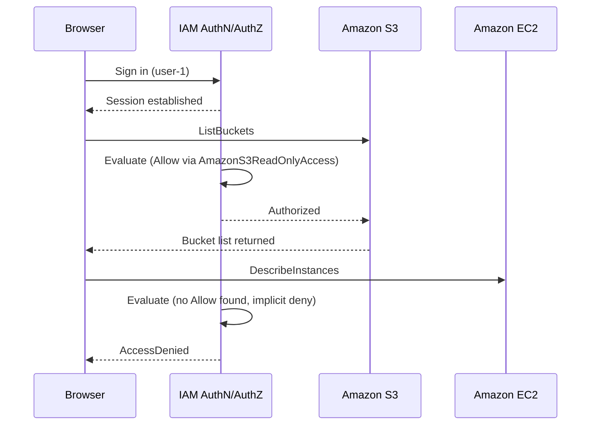

# Chapter 8 Lab: AWS Cloud Security

---

## 8.12 Lab: Introduction to AWS IAM

This lab creates three users, three groups with different permissions, and a test EC2 instance, then proves the permissions work by signing in as each user.

**What you will build**

| Group | Permissions | Member | Expected result |
| --- | --- | --- | --- |
| `S3-Support` | `AmazonS3ReadOnlyAccess`, AWS managed | `user-1` | S3 read succeeds, EC2 denied |
| `EC2-Support` | `AmazonEC2ReadOnlyAccess`, AWS managed | `user-2` | EC2 describe succeeds, EC2 stop denied, S3 denied |
| `EC2-Admin` | Inline policy allowing describe, start, and stop | `user-3` | EC2 describe succeeds, EC2 stop succeeds |

**Prerequisites**

- An AWS account with administrator access.
- Work in `us-east-1` throughout, or substitute one Region consistently.

### 8.12.1 Step 1: Create the IAM Users

1. Sign in to the AWS Management Console as an administrator.
2. Confirm the Region selector shows the Region you intend to use. IAM itself is global, but the EC2 instance created later is not.
3. Type `IAM` in the search bar and select **IAM**.
4. In the left navigation pane, choose **Users**.
5. Choose **Create user**.
6. Enter the user name `user-1`.
7. Select **Provide user access to the AWS Management Console**.
8. Select **I want to create an IAM user**. The console recommends IAM Identity Center by default, so this choice must be made explicitly.
9. Choose **Custom password** and enter `Lab-Password1`.
10. Clear the **Users must create a new password at next sign-in** checkbox.
11. Choose **Next**.
12. Attach no permissions. Choose **Next**, then **Create user**.
13. Repeat steps 5 to 12 for `user-2` with password `Lab-Password2`.
14. Repeat steps 5 to 12 for `user-3` with password `Lab-Password3`.

### 8.12.2 Step 2: Review the Users

1. Choose **Users** in the navigation pane.
2. Confirm `user-1`, `user-2`, and `user-3` are listed.
3. Select `user-1`.
4. On the **Permissions** tab, confirm no policies are attached.
5. On the **Groups** tab, confirm no group memberships exist.
6. On the **Security credentials** tab, confirm a console password is set.
7. Repeat the review for `user-2` and `user-3`.

### 8.12.3 Step 3: Create the Groups

1. In the navigation pane, choose **User groups**.
2. Choose **Create group**.
3. Enter the group name `S3-Support`.
4. Do not add users yet.
5. Under **Attach permissions policies**, search for and select `AmazonS3ReadOnlyAccess`.
6. Choose **Create user group**.
7. Choose **Create group** again.
8. Enter the group name `EC2-Support`.
9. Search for and select `AmazonEC2ReadOnlyAccess`.
10. Choose **Create user group**.
11. Choose **Create group** again.
12. Enter the group name `EC2-Admin`.
13. Attach no managed policy.
14. Choose **Create user group**.

### 8.12.4 Step 4: Add the Inline Policy to EC2-Admin

1. Choose **User groups**, then select `EC2-Admin`.
2. Open the **Permissions** tab.
3. Choose **Add permissions**, then **Create inline policy**.
4. Switch the editor to **JSON**.
5. Replace the contents with the following:

   ```json
   {
     "Version": "2012-10-17",
     "Statement": [
       {
         "Sid": "EC2ViewAndLifecycle",
         "Effect": "Allow",
         "Action": [
           "ec2:Describe*",
           "ec2:StartInstances",
           "ec2:StopInstances"
         ],
         "Resource": "*"
       }
     ]
   }
   ```

6. Choose **Next**.
7. Name the policy `EC2AdminInlinePolicy`.
8. Choose **Create policy**.

Note that `ec2:Describe*` actions do not support resource-level permissions, which is why `Resource` is `*` here. In production, `StartInstances` and `StopInstances` would normally be scoped to specific instances or constrained by a tag condition.

### 8.12.5 Step 5: Review the Group Permissions

1. Choose **User groups**, then select `EC2-Support`.
2. On the **Permissions** tab, expand `AmazonEC2ReadOnlyAccess` and note that it grants describe actions across EC2, Elastic Load Balancing, CloudWatch, and Auto Scaling.
3. Return to **User groups** and select `S3-Support`.
4. Expand `AmazonS3ReadOnlyAccess` and confirm it grants only `s3:Get*` and `s3:List*` actions.
5. Return to **User groups** and select `EC2-Admin`.
6. Expand `EC2AdminInlinePolicy` and confirm it allows describe, start, and stop on all resources.

### 8.12.6 Step 6: Assign Users to Groups

1. Choose **User groups**, then select `S3-Support`.
2. Open the **Users** tab and choose **Add users**.
3. Select `user-1` and choose **Add users**.
4. Return to **User groups** and select `EC2-Support`.
5. Open the **Users** tab and choose **Add users**.
6. Select `user-2` and choose **Add users**.
7. Return to **User groups** and select `EC2-Admin`.
8. Open the **Users** tab and choose **Add users**.
9. Select `user-3` and choose **Add users**.
10. Return to the **User groups** list and confirm each group shows 1 in the **Users** column.

### 8.12.7 Step 7: Launch the Test EC2 Instance

The instance only needs to exist in a running state so that `user-2` and `user-3` have something to see and attempt to stop.

1. Open the **EC2** console.
2. Confirm the Region matches the one chosen in step 1.
3. Choose **Instances**, then **Launch instances**.
4. In **Name**, enter `LabHost`.
5. Under **Application and OS Images**, select **Amazon Linux 2023**.
6. Under **Instance type**, select an instance type marked **Free tier eligible**, typically `t2.micro` or `t3.micro`. Free tier eligibility depends on when your account was created, as described in section 7.2.
7. Under **Key pair**, select **Proceed without a key pair**. No SSH access is needed.
8. Under **Network settings**, accept the default VPC, default subnet, and default security group.
9. Leave all remaining settings at their defaults.
10. Choose **Launch instance**.
11. Wait until the instance state shows **Running**.

### 8.12.8 Step 8: Get the Sign-In URL

1. Return to the **IAM** console.
2. Choose **Dashboard** in the navigation pane.
3. Under **AWS Account**, copy the **Sign-in URL for IAM users**. It has the form `https://<account-id>.signin.aws.amazon.com/console`.

Use a private or incognito browser window for each test below, so the tests do not conflict with your administrator session.

### 8.12.9 Step 9: Test user-1, S3 Read-Only



1. Open a private browser window and go to the sign-in URL.
2. Sign in as `user-1` with password `Lab-Password1`.
3. Open the **S3** console.
4. Confirm the bucket list is visible and buckets can be browsed read-only.
5. Open the **EC2** console and choose **Instances**.
6. Confirm an authorization error appears and no instance data is returned.
7. Sign out and close the window.

### 8.12.10 Step 10: Test user-2, EC2 Read-Only

1. Open a new private browser window and go to the sign-in URL.
2. Sign in as `user-2` with password `Lab-Password2`.
3. Open the **EC2** console and choose **Instances**.
4. Confirm the instance named `LabHost` is visible.
5. Select `LabHost`.
6. Choose **Instance state**, then **Stop instance**, and confirm.
7. Confirm a "not authorized" error appears and the instance keeps running.
8. Open the **S3** console.
9. Confirm an authorization error appears when the bucket list tries to load.
10. Sign out and close the window.

### 8.12.11 Step 11: Test user-3, EC2 Admin

1. Open a new private browser window and go to the sign-in URL.
2. Sign in as `user-3` with password `Lab-Password3`.
3. Open the **EC2** console and choose **Instances**.
4. Confirm `LabHost` is visible.
5. Select `LabHost`.
6. Choose **Instance state**, then **Stop instance**, and confirm.
7. Confirm the state changes to **stopping** and then **stopped**. The inline policy is working.
8. Sign out and close the window.

**What the three tests demonstrate**

- `user-1` and `user-2` were denied without any deny statement existing anywhere. Absence of an allow is sufficient.
- `user-2` could describe instances but not stop them, because `AmazonEC2ReadOnlyAccess` grants only describe actions. Read and write are distinct permissions on the same service.
- `user-3` gained its permissions purely through group membership. No policy was attached to the user directly.

### 8.12.12 Cleanup

1. Open the **EC2** console, select `LabHost`, choose **Instance state**, then **Terminate instance**, and confirm.
2. Open the **IAM** console and choose **Users**.
3. Select `user-1`, `user-2`, and `user-3`, choose **Delete**, type the confirmation text, and confirm.
4. Choose **User groups**.
5. Select `S3-Support`, `EC2-Support`, and `EC2-Admin`, choose **Delete**, and confirm. The inline policy is deleted with its group.
6. Return to the **EC2** console and confirm no instances remain in the **Running** state.

---
