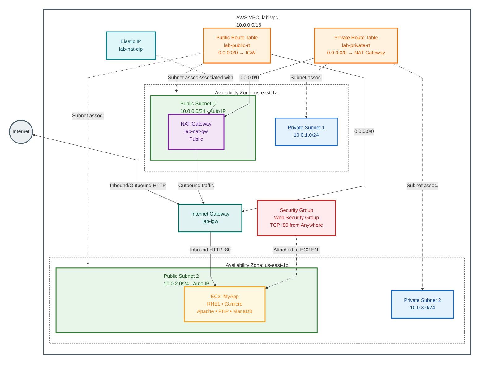
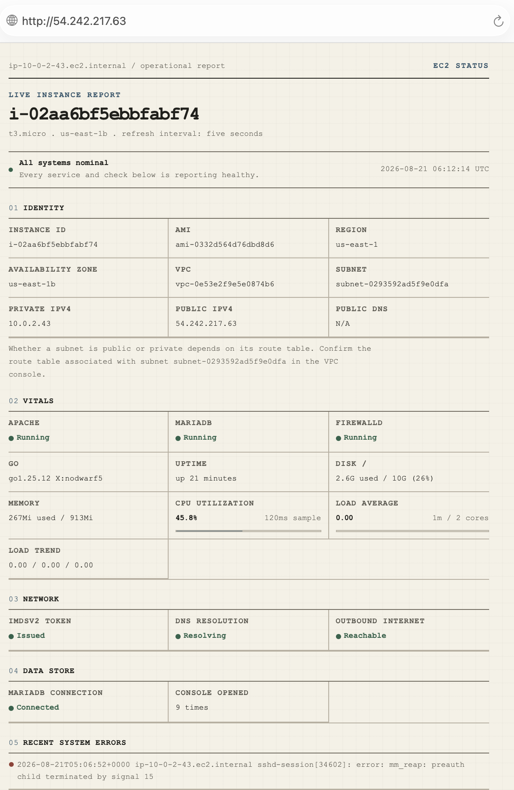

# Chapter 9 Lab: Networking and Content Delivery


## 9.8 Lab: Build a VPC and Launch a Web Server

**Objectives**

- Create a VPC with public and private subnets across two Availability Zones.

- Configure an internet gateway, a NAT gateway, and route tables.

- Create a security group allowing web traffic.

- Launch an Apache web server on EC2 and verify it from a browser.

**Architecture**


---

> Cost warning: 

>The NAT gateway in this lab bills per hour from the moment it is created, and it is not covered by the free tier. Complete the lab in one sitting and follow the cleanup in section 9.8.11.

---
## 9.8.1 Step 1: Set the Region

1. Sign in to the AWS Management Console.

2. Open the Region selector at the top right and choose **US East (N. Virginia)**, `us-east-1`.

3. Confirm the Region indicator reads **N. Virginia** before continuing.

---
## 9.8.2 Step 2: Create the VPC

1. Type `VPC` in the search bar and open the **VPC** console.

2. Choose **Your VPCs** in the navigation pane.

3. Choose **Create VPC**.

4. Under **Resources to create**, select **VPC only**.

5. In **Name tag**, enter `lab-vpc`.

6. In **IPv4 CIDR block**, enter `10.0.0.0/16`.

7. Leave **IPv6 CIDR block** set to **No IPv6 CIDR block**.

8. Leave **Tenancy** set to **Default**.

9. Choose **Create VPC**.

10. Confirm the VPC appears with state **Available**.


---
## 9.8.3 Step 3: Create the Four Subnets

1. Choose **Subnets** in the navigation pane.

2. Choose **Create subnet**.

3. Select `lab-vpc` as the VPC.

4. In **Subnet name**, enter `Public Subnet 1`.

5. Set **Availability Zone** to `us-east-1a`.

6. Set **IPv4 subnet CIDR block** to `10.0.0.0/24`.

7. Choose **Create subnet**.

8. Select `Public Subnet 1`, choose **Actions**, then **Edit subnet settings**.

9. Select **Enable auto-assign public IPv4 address**, then choose **Save**.

---
10. Choose **Create subnet** again.

11. Select `lab-vpc`, name the subnet `Private Subnet 1`, set the Availability Zone to `us-east-1a`, and set the CIDR to `10.0.1.0/24`.

12. Choose **Create subnet**. Leave auto-assign public IPv4 disabled.

---
13. Choose **Create subnet** again.

14. Select `lab-vpc`, name the subnet `Public Subnet 2`, set the Availability Zone to `us-east-1b`, and set the CIDR to `10.0.2.0/24`.

15. Choose **Create subnet**.

16. Select `Public Subnet 2`, choose **Actions**, then **Edit subnet settings**, enable auto-assign public IPv4, and choose **Save**.

---
17. Choose **Create subnet** again.

18. Select `lab-vpc`, name the subnet `Private Subnet 2`, set the Availability Zone to `us-east-1b`, and set the CIDR to `10.0.3.0/24`.

19. Choose **Create subnet**. Leave auto-assign public IPv4 disabled.

---
20. Confirm all four subnets are listed against `lab-vpc`.


---
## 9.8.4 Step 4: Create and Attach the Internet Gateway

1. Choose **Internet gateways** in the left side navigation pane.

2. Choose **Create internet gateway**.

3. In **Name tag**, enter `lab-igw`.

4. Choose **Create internet gateway**.

5. Select `lab-igw`, choose **Actions**, then **Attach to VPC**.

6. Select `lab-vpc`.

7. Choose **Attach internet gateway**.

8. Confirm the state now reads **Attached**.


---
## 9.8.5 Step 5: Allocate an Elastic IP

1. Choose **Elastic IPs** in the left side navigation pane.

2. Choose **Allocate Elastic IP address**.

3. Set **Network border group** to `us-east-1`.

4. Add a tag with key `Name` and value `lab-nat-eip`.

5. Choose **Allocate**.

---
## 9.8.6 Step 6: Create the NAT Gateway

1. Choose **NAT gateways** in the navigation pane.

2. Choose **Create NAT gateway**.

3. In **Name**, enter `lab-nat-gw`.

4. Availability mode: `Zonal`

5. Set **Subnet** to `Public Subnet 1`. A NAT gateway must sit in a public subnet.

5. Set **Connectivity type** to **Public**.

6. For **Elastic IP allocation ID**, select `lab-nat-eip`.

7. Choose **Create NAT gateway**.

8. Wait until the status shows **Available**. This takes a few minutes, and the next steps will not work until it does.


---
## 9.8.7 Step 7: Create the Public Route Table

1. Choose **Route tables** in the navigation pane.

2. Choose **Create route table**.

3. In **Name**, enter `lab-public-rt`.

4. Select `lab-vpc`.

5. Choose **Create route table**.

6. With `lab-public-rt` selected, open the **Routes** tab.

7. Choose **Edit routes**.

8. Choose **Add route**.

9. Set **Destination** to `0.0.0.0/0`.

10. Set **Target** to **Internet Gateway**, then select `lab-igw`.


---
11. Choose **Save changes**.

12. Open the **Subnet associations** tab.

13. Under **Subnets without explicit associations**, choose **Edit subnet associations**.

14. Select **Public Subnet 1** and **Public Subnet 2**.

15. Choose **Save associations**.

---
## 9.8.8 Step 8: Create the Private Route Table

1. Choose **Create route table**.

2. In **Name**, enter `lab-private-rt`.

3. Select `lab-vpc`.

4. Choose **Create route table**.

5. With `lab-private-rt` selected, open the **Routes** tab.

6. Choose **Edit routes**.

7. Choose **Add route**.

8. Set **Destination** to `0.0.0.0/0`.

9. Set **Target** to **NAT Gateway**, then select `lab-nat-gw`.

10. Choose **Save changes**.

11. Open the **Subnet associations** tab.

12. Choose **Subnets without explicit associations**, **Edit subnet associations**.

13. Select **Private Subnet 1** and **Private Subnet 2**.

14. Choose **Save associations**.

---
## 9.8.9 Step 9: Verify the VPC Layout

1. Choose **Your VPCs** in the navigation pane.

2. Select `lab-vpc`.

3. Open the **Resource map** tab.


---
4. Confirm both public subnets route to the internet gateway and both private subnets route through the NAT gateway.

---


---


---


---


---
## 9.8.10 Step 10: Create the Security Group, Key Pair, and Web Server

### Create the security group

1. Choose **Security groups** in the VPC console navigation pane.

2. Choose **Create security group**.

3. In **Security group name**, enter `Web Security Group`.

4. In **Description**, enter `Allow dashboard HTTP and administration SSH`.

5. Set **VPC** to `lab-vpc`.

6. Under **Inbound rules**, choose **Add rule**.

7. Set **Type** to `HTTP` and **Source type** to **Anywhere-IPv4**.

8. Set **Type** to `SSH` and **Source type** to **Anywhere-IPv4**.

9. Leave the outbound rules at the default, which allows all traffic.

10. Choose **Create security group**.


---
### Create the key pair

11. Open the **EC2** console and choose **Key pairs**.

12. Choose **Create key pair**.

13. In **Name**, enter `MyLoginKey`.

14. Set **Key pair type** to **RSA**.

15. Set **Private key file format** to `.pem`, or `.ppk` if you will connect with PuTTY on Windows.

16. Choose **Create key pair** and store the downloaded file securely, as described in section 7.6.

On macOS or Linux, restrict the private key file so SSH will accept it:
```
chmod 400 MyLoginKey.pem
```

---
### Launch the web server

17. In the EC2 console, choose **Instances**, then **Launch instances**.

18. In **Name**, enter `MyServerDetailsApp`

19. Under **Application and OS Images**, choose **Amazon Linux 2023**

20. Set **Instance type** to `t3.micro`.

21. Set **Key pair** to `MyLoginKey`.

22. Under **Network settings**, choose **Edit**.

23. Set **VPC** to `lab-vpc`.

24. Set **Subnet** to `Public Subnet 2 (us-east-1b)`.

25. Set **Auto-assign public IP** to **Enable**.

26. Under **Firewall**, choose **Select existing security group** and select `Web Security Group`.

27. Leave **Storage** at the default 10 GiB gp3 volume.

28. Expand **Advanced details** and locate the metadata settings.

29. Set Metadata accessible to Enabled and Metadata version to V2 only, token required. 

>Amazon Linux 2023 already defaults to IMDSv2, but selecting it explicitly makes the setting visible for the lab, and the dashboard code reads metadata through an IMDSv2 token.

30. Leave User data empty. This lab installs and configures the application by hand through EC2 Instance Connect in the next step, so no bootstrap script runs at launch, and no database password is ever placed in user data or instance metadata.

31. Choose **Launch instance**.

32. Choose the instance ID in the confirmation banner to open its details.

33. Wait until **Instance state** shows **Running** and **Status checks** shows **3/3 checks passed**.

34. Note the **Public IPv4 address** and **Public IPv4 DNS** values in the **Details** pane.

---
## 9.8.11 Step 11: Deploy the Go Dashboard Through EC2 Instance Connect
 
The AWS Management Console builds and configures the network and the instance. Everything from here runs in a browser terminal opened directly from the console, so no local SSH client or key file is required for this part.
 
### Open EC2 Instance Connect
 
1. In the EC2 console, select `MyServerDetailsApp`.

2. Choose **Connect**.

3. Open the **EC2 Instance Connect** tab.

4. Keep the user name as `ec2-user`.

5. Choose **Connect**.


A browser terminal opens against the instance.
---
### Install the required packages
 
6. Update the instance and install Go, Apache, MariaDB, firewalld, and the SELinux policy tools:

```bash
sudo dnf install -y golang httpd mariadb105-server firewalld policycoreutils-python-utils openssl
```

> `policycoreutils-python-utils`: SELinux management tools.

> `openssl`: SSL/TLS, cryptography, keys, and certificate tools.

7. Enable and start the base services:
```bash
sudo systemctl enable --now firewalld
```
```bash
sudo systemctl enable --now mariadb
```
```bash
sudo systemctl enable --now httpd
```
 
8. Open HTTP in the instance firewall:
```bash
sudo firewall-cmd --permanent --add-service=http
```
```bash
sudo firewall-cmd --reload
```

9. Allow Apache to reach the Go service over a local TCP socket under SELinux:
```bash
sudo setsebool -P httpd_can_network_connect on
```

---
### Create the service account
 
10. Create an unprivileged system account for the application, and add it to the journal group so the dashboard can read recent system errors:
```bash
sudo useradd --system --create-home --home-dir /var/lib/ec2-dashboard --shell /sbin/nologin dashboard
```
```bash
sudo usermod -aG systemd-journal dashboard
```
```bash 
sudo install -d -o dashboard -g dashboard -m 0750 /opt/ec2-dashboard
```
---
### Add the Go source
 
11. Create the project directory and open an editor:
```bash
mkdir -p ~/ec2-dashboard
```
```bash
cd ~/ec2-dashboard
```
```bash
nano main.go
```

12. Paste the complete source below into `main.go`

[Source Code:](main.go)

Save with `Ctrl O`, press `Enter`, then exit with `Ctrl X`.

> Do not substitute placeholder or partial code. The listener constant must read `127.0.0.1:8080` so only Apache on the same instance can reach it, and the database config path must read `/etc/dashboard-db.json`.

---
### Build the binary on the instance
 
13. Initialize the module, fetch the MariaDB driver, and build:
```bash
cd ~/ec2-dashboard
```
```bash
go mod init ec2-dashboard
go get github.com/go-sql-driver/mysql
go mod tidy
```
```bash
go build -o ec2-dashboard main.go
```
 
14. Confirm the build produced a binary:
```bash
ls -lh ~/ec2-dashboard/ec2-dashboard
```
> If the above step fails, stop and fix `main.go` before continuing. Do not install a partial or missing binary.
 
15. Install the binary into `/opt/ec2-dashboard`. This step matters: `systemd` will start the service from this exact path, and a service pointed at a binary that was never copied here fails immediately with a `203/EXEC` error.
```bash
sudo install -o dashboard -g dashboard -m 0755 ~/ec2-dashboard/ec2-dashboard /opt/ec2-dashboard/ec2-dashboard
```
---
### Configure MariaDB
 
16. Generate a random application password and store it in a root-only file:
```bash
DB_PASS=$(openssl rand -base64 24)
```
```bash
printf '%s\n' "$DB_PASS" | sudo tee /etc/dashboard-db.pass > /dev/null
```
```bash
sudo chown root:root /etc/dashboard-db.pass
sudo chmod 600 /etc/dashboard-db.pass
```

> Use only the generated `$DB_PASS` value from this point forward. Do not overwrite this file later with a manually typed password. A weak or hand-typed value defeats the point of generating a random one, and a later overwrite will leave this file out of sync with the password actually stored in MariaDB and in `/etc/dashboard-db.json`.

17. Create the database, the counter table, and a least-privilege application user:
```bash
sudo mysql <<SQL
CREATE DATABASE IF NOT EXISTS dashboard
  CHARACTER SET utf8mb4
  COLLATE utf8mb4_unicode_ci;
 
CREATE USER IF NOT EXISTS 'dashboard_app'@'localhost'
  IDENTIFIED BY '${DB_PASS}';
 
ALTER USER 'dashboard_app'@'localhost'
  IDENTIFIED BY '${DB_PASS}';
 
GRANT SELECT, UPDATE ON dashboard.* TO 'dashboard_app'@'localhost';
 
USE dashboard;
 
CREATE TABLE IF NOT EXISTS visitor_counter (
  page_name VARCHAR(50) NOT NULL PRIMARY KEY,
  views BIGINT UNSIGNED NOT NULL DEFAULT 0
);
 
INSERT IGNORE INTO visitor_counter (page_name, views)
VALUES ('dashboard', 0);
 
FLUSH PRIVILEGES;
SQL
```
 
18. Write the JSON config the Go application reads at startup, and lock it down so only root and the `dashboard` group can read it:
```bash
sudo tee /etc/dashboard-db.json > /dev/null <<JSON
{
  "host": "127.0.0.1",
  "port": 3306,
  "user": "dashboard_app",
  "pass": "${DB_PASS}",
  "name": "dashboard"
}
JSON
```
```bash
sudo chown root:dashboard /etc/dashboard-db.json
```
```bash
sudo chmod 640 /etc/dashboard-db.json
```

### Create the systemd service

19. Create the unit file:
```bash
sudo nano /etc/systemd/system/ec2-dashboard.service
```
 
20. Paste the following, save, and exit:
```ini
[Unit]
Description=EC2 VPC Information Dashboard
After=network-online.target mariadb.service
Wants=network-online.target
 
[Service]
Type=simple
User=dashboard
Group=dashboard
WorkingDirectory=/opt/ec2-dashboard
ExecStart=/opt/ec2-dashboard/ec2-dashboard
Restart=on-failure
RestartSec=5
NoNewPrivileges=true
ProtectSystem=strict
ProtectHome=true
PrivateTmp=true
 
[Install]
WantedBy=multi-user.target
```
 
21. Reload systemd, enable, and start the service:
```bash
sudo systemctl daemon-reload
sudo systemctl enable --now ec2-dashboard
```
```bash
sudo systemctl status ec2-dashboard --no-pager
```
 
> You should see `Active: active (running)`. If instead the status cycles through `activating (auto-restart)` with a `203/EXEC` code, the binary is not present at `/opt/ec2-dashboard/ec2-dashboard`. Return to step 15.
 
22. Test the Go service directly, before Apache is in front of it:
```bash
curl --fail --silent \
  http://127.0.0.1:8080/?format=json
```

---
### Configure Apache as the reverse proxy
 
23. Create the Apache site config:
```bash
sudo nano /etc/httpd/conf.d/ec2-dashboard.conf
```
 
24. Paste the following, save, and exit:
```apache
ProxyRequests Off
ProxyPreserveHost On
 
ProxyPass / http://127.0.0.1:8080/
ProxyPassReverse / http://127.0.0.1:8080/
```
 
25. Validate the configuration and restart Apache:
```bash
sudo apachectl configtest
```
```bash
sudo systemctl restart httpd
```
```bash
sudo systemctl status httpd --no-pager
```
 
26. Confirm Apache can reach the Go service locally:
```bash
curl --fail --silent \
  http://127.0.0.1/ \
  > /dev/null
 
echo "Apache reverse proxy is working."
```
 
27. Confirm the firewall and Apache report the expected state:
```bash
sudo firewall-cmd --list-services
```
```bash
sudo systemctl status httpd --no-pager
```
 
The firewall list must include `http`.

---
### View the dashboard in a browser
 
28. Return to the EC2 console, select `MyServerDetailsApp`, and copy the **Public IPv4 DNS** value.

29. Open a browser and go to:
```
http://YOUR_PUBLIC_IPV4/
```


---
30. Confirm the page loads and shows report with:

- EC2 instance ID, instance type, AMI, region, and Availability Zone

- VPC ID, subnet ID, private and public IPv4, and public DNS

- Apache, MariaDB, and firewalld status

- CPU utilization and load average

- IMDSv2, DNS, and outbound internet checks

- The database connection status and the visit counter

- Recent system error journal entries

- Live updates every five seconds through the `?format=json` endpoint

---
## 9.8.12 Troubleshooting
 
Work through these in order if the browser does not show the dashboard.
 
**Browser cannot open the page at all.** Check the security group first, since this is the most common cause:
 
1. In the EC2 console, select the instance, open the **Security** tab, and open **Web Security Group**.
2. Confirm the HTTP rule source matches your current public IP. Home and mobile networks frequently change IP addresses between sessions.
Then check Apache itself:
 
```bash
sudo systemctl status httpd --no-pager
sudo firewall-cmd --list-services
```
 
**Apache responds but returns a 503 Service Unavailable.** This means Apache is running but the Go service behind it is not. Check the service and its recent log lines:
 
```bash
sudo systemctl status ec2-dashboard --no-pager
```
```bash
sudo journalctl -u ec2-dashboard -n 100 --no-pager
```
 
A repeating `Failed to locate executable /opt/ec2-dashboard/ec2-dashboard: No such file or directory` message with exit code `203/EXEC` means the binary was built but never installed to `/opt/ec2-dashboard`. Reinstall it and restart:
 
```bash
sudo install \
  -o dashboard \
  -g dashboard \
  -m 0755 \
  ~/ec2-dashboard/ec2-dashboard \
  /opt/ec2-dashboard/ec2-dashboard
```

```bash
sudo systemctl restart ec2-dashboard
```
```bash
sudo systemctl status ec2-dashboard --no-pager
```
 
**The page loads but the database connection shows Failed.** Confirm MariaDB is running and that `/etc/dashboard-db.json` matches the password actually set on the `dashboard_app` MariaDB user:
 
```bash
sudo systemctl status mariadb --no-pager
```
```bash
sudo cat /etc/dashboard-db.json
```
```bash
sudo journalctl -u ec2-dashboard -n 50 --no-pager
```
 
If the password in the file does not match the database user, reset it to a single known value in both places rather than guessing:
 
```bash
NEW_PASS=$(openssl rand -base64 24)
 
sudo mysql -e "ALTER USER 'dashboard_app'@'localhost' IDENTIFIED BY '${NEW_PASS}'; FLUSH PRIVILEGES;"
 
sudo tee /etc/dashboard-db.json > /dev/null <<JSON
{
  "host": "127.0.0.1",
  "port": 3306,
  "user": "dashboard_app",
  "pass": "${NEW_PASS}",
  "name": "dashboard"
}
JSON
 
sudo chown root:dashboard /etc/dashboard-db.json
sudo chmod 640 /etc/dashboard-db.json
sudo systemctl restart ec2-dashboard
```
 
**IMDSv2 token shows Unavailable.** Test it directly on the instance:
 
```bash
TOKEN=$(curl -sS -X PUT \
  -H "X-aws-ec2-metadata-token-ttl-seconds: 60" \
  http://169.254.169.254/latest/api/token)
 
curl -sS \
  -H "X-aws-ec2-metadata-token: $TOKEN" \
  http://169.254.169.254/latest/meta-data/instance-id
```
 
If this fails to print an instance ID, open the EC2 console, select the instance, choose **Actions**, **Instance settings**, **Modify instance metadata options**, and confirm **IMDSv2** is set to **V2 only, token required**.
 
**Recent system errors are always empty.** This can be normal. If journal errors exist but the dashboard cannot see them, confirm the service account is in the journal group:
 
```bash
id dashboard
sudo -u dashboard journalctl -p err..alert -n 5 --no-pager
```
 
---
## 9.8.13 Cleanup
 
Delete in this order to avoid dependency errors.
 
1. Open **EC2**, choose **Instances**, select `MyServerDetailsApp`, choose **Instance state**, then **Terminate instance**, and confirm.

2. Open **VPC**, choose **NAT gateways**, select `lab-nat-gw`, choose **Actions**, then **Delete NAT gateway**, and confirm. Wait until the status shows **Deleted**.

3. Choose **Internet gateways**, select `lab-igw`, choose **Actions**, then **Detach from VPC**, and confirm.

4. With `lab-igw` still selected, choose **Actions**, then **Delete internet gateway**, and confirm.

5. Choose **Subnets**, select all four lab subnets, choose **Actions**, then **Delete subnet**, and confirm.

6. Choose **Route tables**, select `lab-public-rt` and `lab-private-rt`, choose **Actions**, then **Delete route table**, and confirm. Do not delete the main route table.

7. Choose **Security groups**, select `Web Security Group`, choose **Actions**, then **Delete security groups**, and confirm.

8. Choose **Your VPCs**, select `lab-vpc`, choose **Actions**, then **Delete VPC**, and confirm.

9. Open **EC2**, choose **Elastic IPs**, select `lab-nat-eip`, choose **Actions**, then **Release Elastic IP addresses**, and confirm. An unassociated Elastic IP is billed, so do not skip this.

10. If the key pair is no longer needed, choose **Key pairs**, select `MyLoginKey`, choose **Actions**, then **Delete**.
---
## 9.8.14 Security Notes
 
- The `httpd_can_network_connect` SELinux boolean is required so Apache can proxy requests to the Go service over `127.0.0.1:8080`. It is not related to the Go application talking to IMDS or MariaDB, since those calls happen inside the Go process itself, not inside Apache.

- The Go service listens only on `127.0.0.1:8080`. No security group rule opens port 8080, and the constant in `main.go` prevents the process from ever binding to a public interface, even if a rule were added by mistake.

- The MariaDB application user `dashboard_app` holds only `SELECT` and `UPDATE` on the `dashboard` database, and only from `localhost`. It cannot create or drop tables, and it cannot connect from another host.

- `/etc/dashboard-db.json` is owned by `root:dashboard` with mode `640`, so only root and the `dashboard` service account can read the database password. `/etc/dashboard-db.pass` is `root:root` with mode `600`, and is a backup record of the same generated password, not a second source of truth.

- The security group allows HTTP and SSH only from **My IP**, which is appropriate for a lab and not for a production internet facing deployment. A real deployment would sit behind an Application Load Balancer or CloudFront with TLS termination, restrict SSH to a bastion host or Session Manager, and would not expose an instance directly to the internet on port 80.

- This dashboard reveals instance IDs, VPC and subnet IDs, private and public addresses, service state, and system journal errors. Treat it as internal operational tooling and keep it behind authentication or a private network in any setting beyond this lab.

---