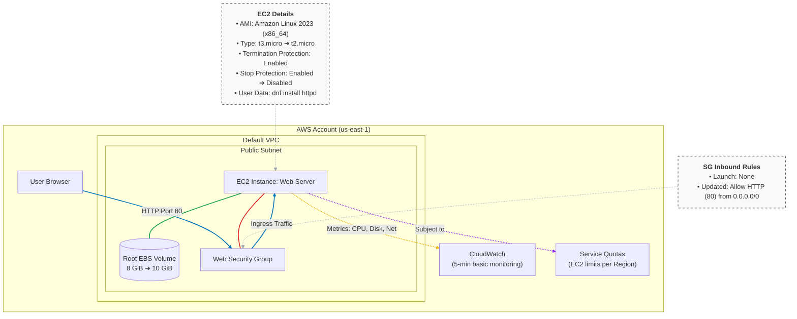
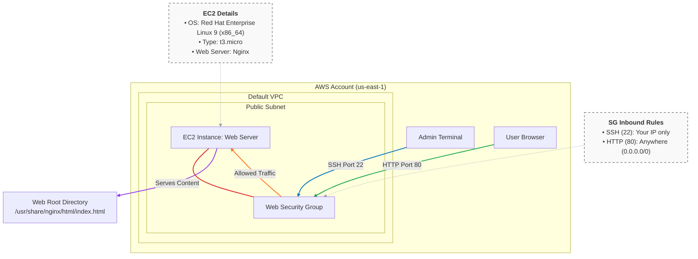
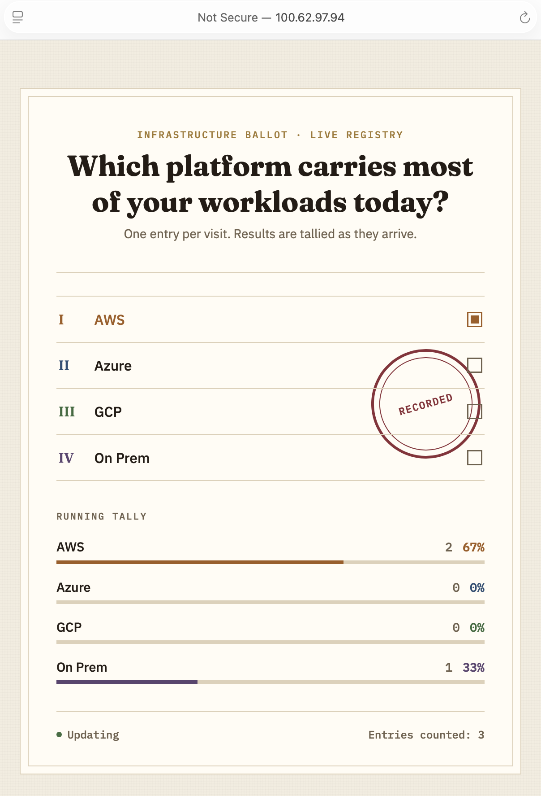

# Chapter 10 Lab: Compute

---
# 10.11 Lab: Introduction to Amazon EC2

**Objectives**

- Launch an EC2 instance with a user data script that installs a web server.

- Monitor instance health and review system logs.

- Update a security group to allow inbound HTTP.

- Resize the instance type and expand the EBS volume.

- Enable and test stop protection.

- Review EC2 service quotas.

---
**Architecture**:

---
### 10.11.1 Step 1: Launch the Instance

1. Sign in to the AWS Management Console.

2. Type `EC2` in the search bar and open the **EC2** console.

3. Confirm the Region selector shows **US East (N. Virginia)**, `us-east-1`.

4. Choose **Instances** in the navigation pane, then **Launch instances**.

5. In **Name and tags**, enter `Web Server`. This creates a tag with key `Name` and value `Web Server`.

6. Under **Application and OS Images**, keep the default **Amazon Linux 2023 AMI (HVM, x86_64)**.

7. Under **Instance type**, keep **t3.micro**.

8. Under **Key pair (login)**, select an existing key pair, or choose **Create new key pair**, name it `MyLabKey`, set type **RSA** and format **.pem**, then choose **Create key pair** and store the downloaded file securely.

9. Next to **Network settings**, choose **Edit**.

10. Set **VPC** to the default VPC.

11. Set **Subnet** to any subnet in the default VPC.

12. Set **Auto-assign public IP** to **Enable**.

13. Under **Firewall (security groups)**, select **Create security group**.

14. Set **Security group name** to `Web Security Group`.

15. Set **Description** to `Security group for my web server`.

16. Remove the default SSH inbound rule by choosing the **X** beside it, leaving no inbound rules. With no inbound rules, all incoming traffic is blocked.

17. Under **Configure storage**, leave the root volume at **8 GiB gp3**.

18. Expand **Advanced details**.

19. Set **Termination protection** to **Enable**. This prevents accidental termination until protection is removed.

20. Scroll to **User data** and paste the following script.

```bash
#!/bin/bash
# Lab: Introduction to EC2
# Install Apache web server
  sudo dnf install -y httpd

# Enable Apache to start on boot and start it now
  sudo systemctl enable --now httpd

# Write a simple HTML page to the web root
  echo '<h1>Greetings from my web server, running in the AWS cloud!</h1>' \
    | sudo tee /var/www/html/index.html > /dev/null
```

21. Choose **Launch instance**.

22. When the success banner appears, choose **View all instances**.

---
### 10.11.2 Step 2: Confirm the Launch and Test Access

1. Select the **Web Server** instance.

2. On the **Details** tab, review the instance type, network settings, security group, and Public IPv4 DNS.

3. Wait until **Instance state** shows **Running** and **Status checks** shows **3/3 checks passed**. This usually takes one to two minutes.

4. Copy the **Public IPv4 address**.

5. Open a new browser tab and go to `http://<Public-IPv4-address>`.

6. Confirm the page times out or refuses to connect. This is the expected result, because the security group has no inbound rules yet.

---
### 10.11.3 Step 3: Monitor the Instance

1. With **Web Server** selected, open the **Status checks** tab.

2. Confirm both checks pass. **System reachability** covers the underlying host and network; **instance reachability** covers whether the guest operating system is responding.

3. Open the **Monitoring** tab.

4. Review the graphs. Data will be sparse immediately after launch, since basic monitoring publishes every 5 minutes.

5. To expand a graph, choose the three-dot menu on its tile and select **Enlarge**.

6. Choose **Actions**, then **Monitor and troubleshoot**, then **Get system log**.

7. Review the console output and look for the `httpd` installation from the user data script.

---

---

8. Choose **Cancel** to close the log.

9. Choose **Actions**, then **Monitor and troubleshoot**, then **Get instance screenshot**. This is useful when SSH or RDP is unavailable.

---

---
10. Choose **Cancel** to close.
---
### 10.11.4 Step 4: Open HTTP Access

1. Select the **Web Server** instance and copy the **Public IPv4 address** from the **Details** tab.

2. Choose **Security Groups** in the navigation pane.

3. Select **Web Security Group**.

4. Open the **Inbound rules** tab and confirm it is empty.

5. Choose **Edit inbound rules**.

6. Choose **Add rule**.

7. Set **Type** to `HTTP`.

8. Set **Source** to **Anywhere-IPv4**, which is `0.0.0.0/0`.

9. Choose **Save rules**.

10. Return to the browser tab and go to `http://<Public-IPv4-address>`, refreshing if the tab is still open.

11. Confirm the Apache page now loads.

---

---
### 10.11.5 Step 5: Resize the Instance and Expand the Volume

1. Choose **Instances**, then select **Web Server**.

2. Choose **Instance state**, then **Stop instance**, and confirm with **Stop**.

3. Wait until the state shows **Stopped**. Compute charges stop here; EBS charges continue.

4. Choose **Actions**, then **Instance settings**, then **Change instance type**.

5. Select **t2.micro**.

6. Choose **Apply**.

---

---

7. Choose **Actions**, then **Instance settings**, then **Change stop protection**.

8. Select **Enable**.

9. Choose **Save**.

10. Open the **Storage** tab and choose the **Volume ID** link to open the volume in the EBS console.

11. Select the volume, then choose **Actions**, then **Modify volume**.

12. Change the size from **8** to **10** GiB.

13. Choose **Modify**, then confirm **Modify** in the dialog.

---


---
> Volume modifications apply without stopping the instance. Growing the file system inside the operating system is a separate step and is not covered here.

14. Return to **Instances** and select **Web Server**.

15. Choose **Instance state**, then **Start instance**.

16. Wait until the state returns to **Running** with **3/3 checks passed**.

---
### 10.11.6 Step 6: Review Service Quotas

Service quotas cap how many resources you can run in a Region, and checking them before a deployment avoids a failed launch.

1. Type `Service Quotas` in the console search bar and open the service.

2. Under **AWS services**, search for `EC2` and select **Amazon Elastic Compute Cloud (Amazon EC2)**.

3. In **Find quota**, type `running on-demand` to filter.

4. Review quota names such as **Running On-Demand Standard (A, C, D, H, I, M, R, T, Z) instances**. These are measured in vCPUs, not instance count.

5. To raise one, select it and choose **Request quota increase**.

---

---

### 10.11.7 Step 7: Test and Disable Stop Protection

1. Open **EC2**, choose **Instances**, and select **Web Server**.

2. Choose **Instance state**, then **Stop instance**, then **Stop**.

3. Confirm an error appears stating the instance cannot be stopped because stop protection is enabled.

---

---

4. Choose **Actions**, then **Instance settings**, then **Change stop protection**.

5. Clear **Enable**.

6. Choose **Save**.

7. Choose **Instance state**, then **Stop instance**, then **Stop**.

8. Confirm the instance transitions to **Stopped**.

---


---
# 10.11.8 Step 8: Challenge: Change the Page

Two ways to change what the server displays.

---
## Edit the file over SSH

1. Set permissions on the private key:
---
  - macOS or Linux:
```bash
chmod 400 MyLabKey.pem
```
---
  - Windows PowerShell:
```powershell
icacls "MyLabKey.pem" /inheritance:r
icacls "MyLabKey.pem" /grant:r "$($env:USERNAME):R"
```
---
> If `icacls` is not found, call it by full path at `C:\Windows\System32\icacls.exe`

> If `ssh` is not found, install it from an elevated PowerShell with `Add-WindowsCapability -Online -Name OpenSSH.Client~~~~0.0.1.0`.
---
2. Add an SSH inbound rule to `Web Security Group` allowing TCP 22 from **My IP**.

3. Select the instance, choose **Connect**, and open the **SSH client** tab.

4. Copy the example command shown, which has the form:
```bash
ssh -i "MyLabKey.pem" ec2-user@<Public-IPv4-DNS>
```
5. Run the command in a terminal and accept the host authenticity prompt.

6. Install and start Apache if it is not already running.

```bash
sudo dnf install -y httpd
```
```bash
sudo systemctl enable httpd --now
```
7. Edit the page.
```bash
sudo vi /var/www/html/index.html
```

8. Paste the World Clock HTML:

[Source Code: Click Here](WorldClock.html)

9. Restart Apache.
```bash
sudo systemctl restart httpd
```
10. Reload the browser and confirm the clocks appear.

---


---
### 10.11.9 Cleanup

Termination protection was enabled at launch, so it must be removed first.

1. Open **EC2** and choose **Instances**.

2. Select **Web Server**.

3. Choose **Actions**, then **Instance settings**, then **Change termination protection**.

4. Clear **Enable** and choose **Save**.

5. Choose **Instance state**, then **Terminate instance**, and confirm.

6. Choose **Volumes** and confirm the root volume was deleted with the instance. Delete it manually if it remains.

7. Choose **Security Groups**, select `Web Security Group`, choose **Actions**, then **Delete security groups**.

8. If the key pair is no longer needed, choose **Key pairs**, select `MyLabKey`, then **Actions**, then **Delete**.

---
---
# 10.12 Lab: Host a Web App on RHEL with Nginx

**Prerequisites**

- An AWS account with permission to launch EC2 instances.

- A terminal with SSH on macOS or Linux, or PowerShell on Windows.

- Basic familiarity with the Linux command line.

**Architecture**:

---
### 10.12.1 Step 1: Launch the Instance

1. Sign in to the console, type `EC2` in the search bar, and open the **EC2** console.

2. Confirm the Region is **US East (N. Virginia)**, `us-east-1`.

3. Choose **Instances**, then **Launch instances**.

4. In **Name**, enter `Web Server`.

5. Under **Application and OS Images**, search for `Red Hat Enterprise Linux` and select the latest RHEL 9 HVM x86_64 image. RHEL 8 works with every step in this lab if RHEL 9 is unavailable in your Region.

6. Set **Instance type** to `t3.micro`.

7. Under **Key pair (login)**, select an existing key pair, or choose **Create new key pair**, name it `MyLabKey`, set type **RSA** and format **.pem**, and choose **Create key pair**. The file downloads once and cannot be downloaded again.

8. Next to **Network settings**, choose **Edit**.

9. Set **VPC** to the default VPC and leave **Subnet** and **Availability Zone** at no preference.

10. Set **Auto-assign public IP** to **Enable**.

11. Under **Firewall**, choose **Create security group**, or select an existing one.

12. Set **Security group name** to `Web Security Group` and **Description** to `Allow HTTP and SSH`.

13. Add an inbound rule: **Type** `SSH`, **Port** 22, **Source** **My IP**. Leaving port 22 open to `0.0.0.0/0` exposes the instance to brute-force attempts.

14. Add a second inbound rule: **Type** `HTTP`, **Port** 80, **Source** **Anywhere-IPv4**.

15. Leave the root volume at **10 GiB gp3**.

16. Choose **Launch instance**, then **View all instances**.

17. Wait until **Instance state** shows **Running** and **Status checks** shows **3/3 checks passed**.

---
### 10.12.2 Step 2: Connect over SSH

1. Select the **Web Server** instance.

2. On the **Details** tab, copy the **Public IPv4 address** or **Public IPv4 DNS**. Choosing **Connect**, then the **SSH client** tab, shows the exact command.

3. Set permissions on the private key so other users cannot read it:
  - macOS or Linux:
  ```bash
  chmod 400 MyLabKey.pem
  ```
---  
  - Windows PowerShell:
  ```powershell
  icacls "MyLabKey.pem" /inheritance:r
  icacls "MyLabKey.pem" /grant:r "$($env:USERNAME):R"
  ```
4. Connect. The default user for AWS RHEL images is `ec2-user`.
  ```bash
  ssh -i "MyLabKey.pem" ec2-user@<Public-IPv4-address>
  ```
5. Type `yes` at the host authenticity prompt.

6. Confirm you reach a shell prompt of the form `[ec2-user@ip-... ~]$`. If the connection times out, check that the security group allows TCP 22 from your current address and that the instance has finished starting.

---
### 10.12.3 Step 3: Install Nginx

1. Install the package.
  ```bash
  sudo dnf -y install nginx
  ```
2. Enable it at boot and start it now.
  ```bash
  sudo systemctl enable --now nginx
  ```
3. Confirm it is running.
  ```bash
  systemctl status nginx
  ```
4. Check the output shows `Active: active (running)`. Nginx serves from `/usr/share/nginx/html` by default on RHEL.

---
### 10.12.4 Step 4: Deploy

1. Create the HTML file.
  ```bash
  sudo vi /usr/share/nginx/html/index.html
  ```
2. Paste the following content and save.

  ```html
   <!doctype html>
   <html lang="en">
     <head>
       <meta charset="utf-8" />
       <meta name="viewport" content="width=device-width, initial-scale=1" />
       <title>My Nginx Web App on RHEL</title>
       <link rel="stylesheet" href="styles.css" />
     </head>
     <body>
       <main class="container">
         <h1>Hello, I am a Cloud Engineer!</h1>
         <p class="lead">
           This webpage is hosted on an AWS EC2 instance running Red Hat Enterprise Linux with Nginx as the web server.
         </p>
         <button id="clickMe">Click me</button>
         <p id="message" aria-live="polite"></p>
       </main>
       <script src="app.js"></script>
     </body>
   </html>
   ```

3. Create the stylesheet.
```bash
sudo vi /usr/share/nginx/html/styles.css
```
4. Paste the following content and save.

```css
   :root {
     --bg: #faf7f4;
     --fg: #2c1f14;
     --accent: #c2714f;
     --muted: #9c7b6b;
   }
   * { box-sizing: border-box; }
   html, body {
     margin: 0; padding: 0;
     background: var(--bg);
     color: var(--fg);
     font-family: system-ui, -apple-system, Segoe UI, Roboto, sans-serif;
   }
   .container {
     max-width: 720px;
     margin: 10vh auto;
     padding: 2rem;
     border: 1px solid #e8ddd5;
     border-radius: 12px;
     background: #fff9f5;
     box-shadow: 0 10px 30px rgba(100, 60, 30, 0.08);
   }
   h1 { margin-top: 0; color: var(--accent); letter-spacing: 0.3px; }
   .lead { color: var(--muted); }
   button {
     margin-top: 1rem;
     background: transparent;
     color: var(--fg);
     padding: 0.6rem 1rem;
     border: 1px solid var(--accent);
     border-radius: 8px;
     cursor: pointer;
     transition: all 160ms ease-in-out;
   }
   button:hover { background: rgba(194, 113, 79, 0.1); }
   #message { margin-top: 1rem; color: #7a9e7e; min-height: 1.2rem; }
```

5. Create the script file.
```bash
sudo vi /usr/share/nginx/html/app.js
```
6. Paste the following content and save.
```javascript
   document.addEventListener("DOMContentLoaded", () => {
     const btn = document.getElementById("clickMe");
     const msg = document.getElementById("message");
     if (!btn || !msg) return;

     btn.addEventListener("click", () => {
       const now = new Date().toLocaleString();
       msg.textContent = `Button clicked at ${now}. Have a great day!`;
     });
   });
```

7. Set ownership on the three files.
```bash
sudo chown root:root /usr/share/nginx/html/{index.html,styles.css,app.js}
```
8. Set permissions so Nginx can read them and other users cannot modify them.
```bash
sudo chmod 0644 /usr/share/nginx/html/{index.html,styles.css,app.js}
```
9. Restart Nginx.
```bash
sudo systemctl restart nginx
```
---
### 10.12.5 Step 5: Validate in the Browser

1. In the EC2 console, copy the instance's **Public IPv4 address**.

2. Open a browser and go to `http://<Public-IPv4-address>`.

3. Confirm the page renders and the button updates the message.

---

---
### 10.12.6 Cleanup

1. Open **EC2**, choose **Instances**, select **Web Server**.

2. Choose **Instance state**, then **Terminate instance**, and confirm.

3. Choose **Security Groups**, select `Web Security Group`, then **Actions**, then **Delete security groups**.

4. Keep the instance running only if you intend to continue directly into section 10.13, which builds on it.

---
# 10.13 Challenge Lab: Voting Application on Nginx

This extends section 10.12 with a PHP backend, a live updating frontend, and a custom Nginx site configuration. Continue on the same RHEL instance.

### 10.13.1 Step 1: Install and Configure PHP

1. Connect to the instance over SSH.
```bash
ssh -i "MyLabKey.pem" ec2-user@<Public-IPv4-address>
```
2. Install Nginx, PHP, and the required extensions.
```bash
   sudo dnf install -y nginx php php-fpm php-json
```
3. Set PHP-FPM to run as the `nginx` user.
```bash
   sudo sed -i 's/^user = apache/user = nginx/'  /etc/php-fpm.d/www.conf
```
```bash
   sudo sed -i 's/^group = apache/group = nginx/' /etc/php-fpm.d/www.conf
```
---
### 10.13.2 Step 2: Create the Directories

1. Create the application directory.
```bash
  sudo mkdir -p /var/www/poll
```
2. Set ownership.
```bash
 sudo chown -R nginx:nginx /var/www/poll
```
3. Set permissions.
```bash
  sudo chmod -R 755 /var/www/poll
```
4. Create the writable data directory where votes are stored.
```bash
  sudo mkdir -p /var/lib/cloud-poll
```
5. Set ownership on it.
```bash
  sudo chown nginx:nginx /var/lib/cloud-poll
```
6. Set permissions on it.
```bash
  sudo chmod 750 /var/lib/cloud-poll
```
---
### 10.13.3 Step 3: Configure SELinux

RHEL enforces SELinux by default, and the application will fail silently without these two changes.

1. Install the SELinux management tools if `semanage` is missing.
```bash
  sudo dnf install -y policycoreutils-python-utils
```
2. Allow Nginx to connect to the PHP-FPM socket.
```bash
   sudo setsebool -P httpd_can_network_connect 1
```
3. Label the data directory so PHP-FPM may write to it.
```bash
   sudo semanage fcontext -a -t httpd_var_lib_t "/var/lib/cloud-poll(/.*)?"
   sudo restorecon -Rv /var/lib/cloud-poll
```
---
### 10.13.4 Step 4: Create the API Backend

1. Create the file.
```bash
   sudo vi /var/www/poll/vote.php
```
2. Paste the following and save.

[Source Code: Click Here](Vote.php)

---
### 10.13.5 Step 5: Create the Frontend

1. Create the file.
```bash
   sudo vi /var/www/poll/index.php
```
2. Paste the following and save.

[Source Code: Click Here](VoteFrontend.php)

---
### 10.13.6 Step 6: Configure Nginx

1. Create the site configuration

```bash
sudo vi /etc/nginx/conf.d/poll.conf
```

2. Paste the following and save.

```nginx
server {
    listen       80;
    server_name  _;
    root         /var/www/poll;
    index        index.php;

    location / {
        try_files $uri $uri/ /index.php$is_args$args;
    }

    location ~ \.php$ {
        fastcgi_pass  unix:/run/php-fpm/www.sock;
        fastcgi_index index.php;
        fastcgi_param SCRIPT_FILENAME $document_root$fastcgi_script_name;
        include       fastcgi_params;
    }

    location ~ /\.ht { deny all; }
}
```

3. Remove the default configuration so it does not conflict.
```bash
  sudo rm -f /etc/nginx/conf.d/default.conf
```
4. Test the configuration.
```bash
  sudo nginx -t
```
5. Confirm the output reports the syntax is ok and the test is successful.

---
### 10.13.7 Step 7: Open the Local Firewall

This is only needed if `firewalld` is running on the instance.

1. Install it if it is absent.
```bash
sudo dnf install -y firewalld
```
2. Enable and start it.
```bash
sudo systemctl enable --now firewalld
```
3. Allow HTTP.
```bash
sudo firewall-cmd --permanent --add-service=http
```
4. Reload and verify.
```bash
sudo firewall-cmd --reload
sudo firewall-cmd --list-all
```

---
### 10.13.8 Step 8: Start Services and Verify

1. Enable and start PHP-FPM.
```bash
sudo systemctl enable --now php-fpm
```
2. Enable and start Nginx.
```bash
sudo systemctl enable --now nginx
```
3. Check both services.
```bash
sudo systemctl status nginx php-fpm
```
4. Restart Nginx to pick up the new configuration.
```bash
sudo systemctl restart nginx
```
5. Open `http://<Public-IPv4-address>` in a browser.

6. Cast a vote and confirm the bars and totals update, and that reloading preserves the result.

---

---

> If the page returns 502 Bad Gateway, the PHP-FPM socket path is wrong or the service is not running. Check `systemctl status php-fpm` and confirm the socket exists at `/run/php-fpm/www.sock`. **If votes do not persist**, SELinux is blocking the write; recheck step 3 and inspect denials with `sudo ausearch -m AVC -ts recent`.

---
### 10.13.9 Cleanup

1. Open **EC2**, choose **Instances**, select **Web Server**.

2. Choose **Instance state**, then **Terminate instance**, and confirm.

3. Choose **Security Groups**, select `Web Security Group`, then **Actions**, then **Delete security groups**.

---
## 10.14 Lab: Lambda Function Triggered by EventBridge

This builds a scheduled function that stops a running EC2 instance every minute, which is the classic cost-control automation and a clear demonstration of event-driven compute.

**Cost warning.** 

The EventBridge rule fires every minute. Complete the lab in one sitting and delete the rule in cleanup.

---
### 10.14.1 Step 1: Prepare the Execution Role

The original version of this lab used a role named `LabRole`, which exists only in AWS Academy accounts. In a personal account, create the role first.

**If you are in an AWS Academy environment**

1. Open the **IAM** console.
2. Choose **Roles**.
3. Search for `LabRole`.
4. Confirm it appears in the list and skip to section 10.14.2.

---


---
**If you are in your own AWS account**

1. Open the **IAM** console.

2. Choose **Policies**, then **Create policy**.

3. Switch the editor to **JSON** and paste the following.

   ```json
   {
     "Version": "2012-10-17",
     "Statement": [
       {
         "Sid": "StopInstances",
         "Effect": "Allow",
         "Action": ["ec2:StopInstances", "ec2:DescribeInstances"],
         "Resource": "*"
       }
     ]
   }
   ```

4. Choose **Next**, name the policy `LambdaStopInstancesPolicy`, and choose **Create policy**.

5. Choose **Roles**, then **Create role**.

6. Set **Trusted entity type** to **AWS service** and **Use case** to **Lambda**.

7. Choose **Next**.

8. Attach `LambdaStopInstancesPolicy` and `AWSLambdaBasicExecutionRole`. The second grants permission to write CloudWatch logs.

9. Choose **Next**, name the role `LambdaStopinatorRole`, and choose **Create role**.

Wherever the steps below say `LabRole`, use `LambdaStopinatorRole` instead.

---
### 10.14.2 Step 2: Launch the Target Instance

1. Type `EC2` in the search bar and open the **EC2** console.

2. Choose **Launch instance**.

3. In **Name**, enter `instance1`.

4. Keep the default **Amazon Linux 2023** AMI.

5. Set **Instance type** to a free tier eligible type such as `t3.micro`.

6. Under **Key pair (login)**, choose **Proceed without a key pair**. No connection is needed.

7. Leave the network settings at their defaults.

8. Choose **Launch instance**.

9. Choose **View all instances**.

---


---
10. Wait until `instance1` reaches the **Running** state, usually 30 to 60 seconds.

11. Select `instance1` to open its details.

12. On the **Details** tab, copy the **Instance ID**, which has the form `i-0abc123def456789`. You will need it shortly.

13. Note the Region code shown in the Region selector, for example `us-east-1`. You will need this too.

---
### 10.14.3 Step 3: Create the Function

1. Type `Lambda` in the search bar and open the **Lambda** console.

2. Choose **Create function**.

3. Select **Author from scratch**.

4. Set **Function name** to `myStopinator`.

5. Set **Runtime** to the latest available **Python 3.x** version.

6. Leave **Architecture** as `x86_64`.

7. Expand **Change default execution role**.

8. Select **Use an existing role**.

9. Select `LabRole`, or `LambdaStopinatorRole` if you created your own.

10. Choose **Create function**.

---
### 10.14.4 Step 4: Add the EventBridge Trigger

1. On the `myStopinator` page, choose **Add trigger**.

2. In the trigger configuration dropdown, search for and select **EventBridge (CloudWatch Events)**.

---


---
3. Under **Rule**, select **Create a new rule**.

4. Set **Rule name** to `everyMinute`.

5. Set **Rule description** to `Triggers myStopinator every minute`.

6. Set **Rule type** to **Schedule expression**.

7. Set **Schedule expression** to `rate(1 minute)`.

---


---
8. Choose **Add**.

---


---
### 10.14.5 Step 5: Write and Deploy the Code

1. Scroll to the **Code source** section.

2. In the file tree, choose `lambda_function.py` to open it in the editor.

3. Select all existing code and delete it.

4. Paste the following.

   ```python
   import boto3

   region = '<REPLACE_WITH_REGION>'
   instances = ['<REPLACE_WITH_INSTANCE_ID>']
   ec2 = boto3.client('ec2', region_name=region)

   def lambda_handler(event, context):
       ec2.stop_instances(InstanceIds=instances)
       print('stopped your instances: ' + str(instances))
   ```

5. Replace `<REPLACE_WITH_REGION>`, including the angle brackets, with the Region code noted in step 2.

6. Replace `<REPLACE_WITH_INSTANCE_ID>`, including the angle brackets, with the instance ID copied in step 2.

---


---
7. Choose **File**, then **Save**.

8. Choose **Deploy**.

---


---
### 10.14.6 Step 6: Verify

1. On the `myStopinator` page, open the **Monitor** tab.

2. Choose **View CloudWatch logs**, which opens the log group in a new tab.

3. Choose the most recent log stream at the top of the list.

4. Confirm a log entry showing the stopped instance message.

5. Switch to the EC2 console tab and choose **Instances**.

6. Check the **Instance state** column for `instance1`.

7. Confirm that after one to two minutes it reads **Stopping** or **Stopped**.

---


---
8. Select `instance1`, choose **Instance state**, then **Start instance**.

9. Wait for the state to reach **Running**.

10. Wait approximately one minute, then refresh.

11. Confirm the instance returns to **Stopped**, having been stopped automatically by the function.

---


---


---


---
### 10.14.7 Cleanup

Delete the rule first, or the function will keep firing.

1. On the `myStopinator` page, select the `everyMinute` trigger and choose **Delete**.

2. Choose **Actions**, then **Delete function**, and confirm.

3. Open **EC2**, choose **Instances**, select `instance1`, choose **Instance state**, then **Terminate instance**, and confirm.

4. Open **CloudWatch**, choose **Log groups**, and delete `/aws/lambda/myStopinator` if you do not want to keep the logs.

5. If you created `LambdaStopinatorRole` and `LambdaStopInstancesPolicy`, delete them from the **IAM** console.

---
## 10.15 Lab: Deploy a Web Application with Elastic Beanstalk

This deploys a prebuilt Java and Tomcat e-commerce application, then examines the resources Beanstalk creates on your behalf.


**Cost warning.** 

The high availability preset runs at least two instances behind an Application Load Balancer. The load balancer bills per hour and is not free tier eligible.

---
### 10.15.1 Step 1: Download the Application Package

1. Download the sample application from:

[Source Code Download Here:](sherpas-market-1.0.0.war)

2. Save the file somewhere you can find it easily.

---
### 10.15.2 Step 2: Prepare the Service Roles

**In an AWS Academy environment**: 

use `LabRole` as the service role and `LabInstanceProfile` as the EC2 instance profile, and note that you cannot create new IAM roles there.


**In your own AWS account**:

let the console create the defaults, which are `aws-elasticbeanstalk-service-role` and `aws-elasticbeanstalk-ec2-role`. Choose **Create and use new service role** when prompted.

---
### 10.15.3 Step 3: Create the Application and Environment

1. Type `Elastic Beanstalk` in the search bar and open the console.

2. Choose **Create application**.

3. **Environment details** > **Basic details**

4. Set **Application name** to `my-elastic-beanstalk-app`.

5. Leave the auto-filled **Environment name**, or customize it.

6. Leave **Domain** blank to let AWS generate a URL, or enter a subdomain and choose **Check availability**.

7. Set **Platform** to **Tomcat**.

8. Leave **Platform branch** and **Platform version** at the recommended defaults.

9. Under **Application code**, select **Local file** **Choose file**.

10. Choose **Choose file**, and select `sherpas-market-1.0.0.war`.

11. Set **Version label** to `V1.0`.

12. Under **Environment properties**, leave the section unchanged unless the application requires environment variables.

13. Under Platform-specific options, set Proxy server to: `Nginx`

14. Leave Initial JVM heap size at the default value unless the application requires a different JVM configuration.

15. Leave Maximum JVM heap size at the default value unless the application requires a different JVM configuration.

16. Leave JVM command-line options unchanged unless additional Java options are required.

17. Leave Static files unchanged because the application does not require additional static file mappings for this lab.

18. Under Service access, configure the IAM roles required by Elastic Beanstalk. 

**Service access** > Use another role > **LabRole**

**EC2 instance profile** > Use another role **LabInstanceProfile**

19. Leave EC2 key pair blank.

20. Under Infrastructure, confirm that Environment tier is: `Web server environment`

21. Under Scaling, change Environment type from: `Single instance` to `Load balanced`

`Set Minimum instances to:2`

`Set Maximum instances to: 6`

Auto Scaling configuration: `Fleet composition` > `On-Demand Instances`

22. Under Compute, select:

`Architecture: x86_64`

23. Under Instance types, select:

`t3.micro`

`t3.small`

24. Keeping more than one compatible instance type gives Elastic Beanstalk additional capacity options.

25. Under Root volume, leave the Root volume type at the `platform default` unless the lab specifically requires a particular EBS volume type.

26. Leave Size, IOPS, and Throughput at their default values unless additional storage performance or capacity is required.

27. Under Networking, select the required VPC. `default vpc`

28. Under Instance subnets, select at least two subnets located in different Availability Zones. For example:

`us-east-1a`

`us-east-1b`

`us-east-1c`

29. Using subnets in multiple Availability Zones allows the load-balanced environment to distribute application instances across Availability Zones.

30. Under EC2 security groups, leave the default configuration or select an appropriate security group if one has already been created for the application.

31. Do not create additional security groups unless the application requires specific inbound or outbound rules.

32. Load balancer: `Application Load Balancer`

33. Application Load Balancer type: `Dedicated` 

34. Visibility: `Public`

35. Under Monitoring and updates, set Monitoring to: `Enhanced`

36. Enhanced health reporting provides more detailed health information about the application environment and its resources.

37. Set Monitoring interval to: `5 minutes`

38. Leave Email notifications empty unless notification emails are required.

39. Under Logging, leave Instance log streaming to CloudWatch Logs disabled unless centralized application and instance logs are required for the lab.

40. Leave S3 log storage disabled unless long-term log storage is required.

41. Leave Amazon X-Ray disabled unless application tracing is required.

42. Under Deployments, set Deployment policy to: `All at once`

43. For this lab, leave the additional rolling update configuration at its default settings.

44. Keep the application Health check enabled.

45. Leave Health threshold as:`OK`

46. Leave Command timeout at the default: `600 seconds`

47. Under Managed platform updates, keep Managed updates enabled.

48. Set Update level to:

`Minor and patch`

49. Leave the Weekly update window at the default value unless your organization requires a specific maintenance period.

50. Leave Instance replacement disabled unless you specifically want Elastic Beanstalk to replace instances when no other platform update is available.

51. Choose `Create`.

---
### 10.15.4 Step 4: Monitor Creation

1. Wait until the environment health badge at the top left turns green and shows **OK**. This typically takes five to ten minutes.

2. Confirm the message **Environment successfully launched** appears in the events log at the bottom.

---


---
### 10.15.5 Step 5: Verify the Application

1. Find the **Domain** field near the top of the environment dashboard.

2. Choose the URL, which ends in `.elasticbeanstalk.com`.

3. Confirm the application loads.

---


---
4. Browse the application, opening products and moving between pages.

5. Note that the URL is the public address served by the Application Load Balancer, not an instance address.

---
### 10.15.6 Step 6: Explore What Beanstalk Created

1. Open the **EC2** console and choose **Instances**.

2. Confirm two instances are running, both named after the environment.

3. Select one and note its instance type, Availability Zone, and public IP.

---


---
4. Choose **Load Balancers** in the navigation pane.

5. Confirm an Application Load Balancer exists.

6. Select it and review the **Listeners** and **Target groups** tabs.

7. Confirm both instances appear as healthy targets.

---


---
8. Choose **Auto Scaling Groups** in the navigation pane.

9. Select the group associated with the environment.

10. Review the **Activity**, **Instance management**, and **Automatic scaling** tabs.

---


---


---
11. Choose **Security Groups** in the navigation pane.

12. Find the groups named after the environment.

13. Select the one attached to the EC2 instances and review its **Inbound rules**. Note that the instances accept traffic from the load balancer's security group rather than from the internet.

---


---


---
### 10.15.7 Step 7: Monitor the Environment

1. Return to **Elastic Beanstalk** and select the environment.

2. Open the **Health & Monitoring** tab.

3. Review request counts, latency, and instance health.


---


4. Open the **Configuration** tab and browse the configuration categories.

5. Open the **Events** tab and review the actions Beanstalk took while launching and managing the environment.

---
### 10.15.8 Cleanup

1. In **Elastic Beanstalk**, select the environment.

2. Choose **Actions**, then **Terminate environment**.

3. Type the environment name to confirm, then choose **Terminate**. This removes the instances, load balancer, Auto Scaling group, and security groups.

4. Choose **Applications**, select `my-elastic-beanstalk-app`, and choose **Delete application**.

5. Open **S3**, open your bucket, select the uploaded archive, and choose **Delete**.

6. Return to the bucket list, select your bucket, and choose **Delete**. A bucket must be empty before it can be deleted.

7. Open **EC2** and confirm no instances or load balancers remain from the environment.

---