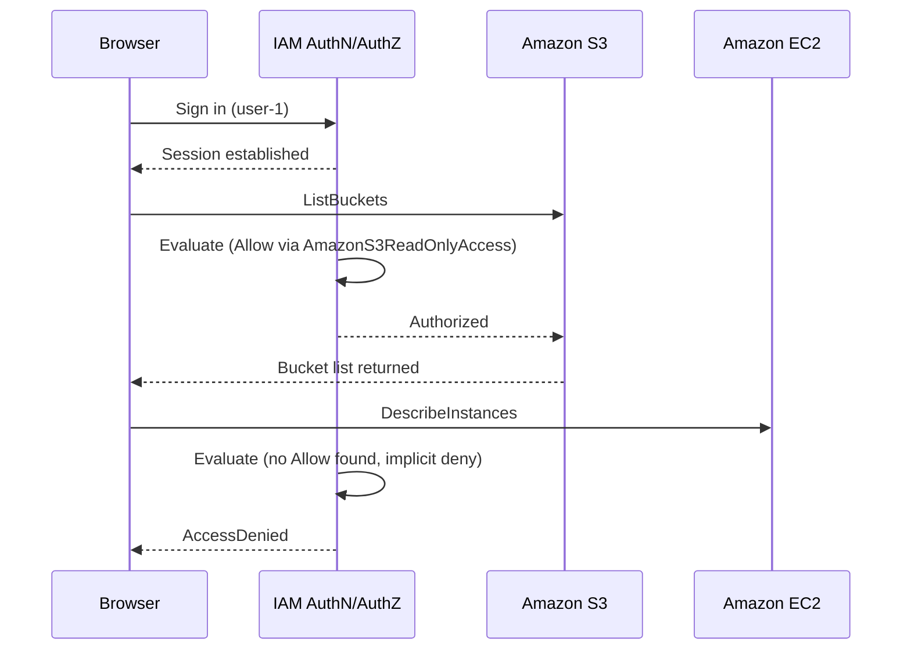

# Chapter 8: AWS Cloud Security

---
Security and Compliance is 30% of the CLF-C02 exam, second only to Cloud Technology and Services, and the shared responsibility model in section 8.1 is the single most frequently tested concept on it. This chapter also defines IAM for the whole course. Chapter 17 designs with it; here we establish what the pieces are.

---
## 8.1 The Shared Responsibility Model

Security in AWS is shared. The line moves depending on which service you use, but the principle does not.

- **AWS is responsible for security *of* the cloud.** Physical facilities, hardware, the host operating system, the virtualization layer, the global network, and the managed service software itself.

- **The customer is responsible for security *in* the cloud.** Data, identity and access management, guest operating system and application patching where applicable, network and firewall configuration, and encryption choices.

### 8.1.1 How the Line Moves by Service Type

| Service type | Example | AWS handles | Customer handles |
| --- | --- | --- | --- |
| Infrastructure services | EC2, EBS, VPC | Facilities, hardware, hypervisor, network fabric | Guest OS and patching, application, security group rules, IAM, encryption, data |
| Container and abstracted services | RDS, Elastic Beanstalk, EMR | All of the above plus the operating system and database engine patching | Engine configuration, network access, IAM, encryption settings, data, backup retention choices |
| Fully abstracted services | Lambda, S3, DynamoDB | Everything up to and including the runtime or storage platform | Function or object configuration, IAM policies, encryption settings, data |

The pattern is worth stating plainly: **the further up the abstraction stack you go, the less you are responsible for, but data, identity, and access configuration never transfer.** That last point is the one exam questions test most often.

### 8.1.2 Worked Examples

| Task | Responsible party |
| --- | --- |
| Physical data center security | AWS |
| Network isolation between customers | AWS |
| Patching the Oracle engine on Amazon RDS | AWS |
| Patching the guest operating system on an EC2 instance | Customer |
| Configuring EC2 security group rules | Customer |
| Configuring subnets and route tables in a VPC | Customer |
| Securing and rotating SSH key pairs | Customer |
| Configuring S3 bucket access | Customer |
| Enforcing MFA on IAM users | Customer |
| Security of the underlying console infrastructure | AWS |
| Encrypting data before or as it is stored | Customer |
| Managing custom AMIs | Customer |

---
## 8.2 IAM Components

AWS Identity and Access Management controls who can access which resources, and under what conditions. It answers three questions on every request: who is asking, what are they allowed to do, and on which resources.

- IAM is a **global** service. Its settings are not Region-specific.

- IAM is **free**. There is no charge for users, groups, roles, or policies.

**The four components**

- **User.** 

A long lived identity representing a person or an application, authenticating with a console password, access keys, or both.

- **Group.** 

A collection of users that share permissions. A user can belong to multiple groups, and permissions from all of them combine. Groups cannot be nested, and a group is not an identity, so a group cannot be a principal in a policy.

- **Policy.** 

A JSON document defining permissions. Identity-based policies attach to users, groups, or roles. Resource based policies attach to a resource such as an S3 bucket or a KMS key.

- **Role.** 

An identity with permissions that can be assumed temporarily by a user, an AWS service, or an external identity. Roles have no long-lived credentials of their own.

---
## 8.3 Authentication and Authorization

**Authentication proves who you are.**

- **Console access** uses the account ID or alias, a user name, a password, and ideally MFA.

- **Programmatic access** uses an access key ID and secret access key, or short lived credentials issued by AWS STS, for CLI, SDK, and direct API calls.

**Authorization decides what you may do.** AWS evaluates every applicable policy on each request:

1. Start from an implicit deny. Nothing is permitted by default.
2. Look for an explicit deny in any applicable policy. If one exists, the request is denied and evaluation stops.
3. Look for an explicit allow. If one exists and no deny applies, the request is permitted.
4. If no allow is found, the implicit deny stands.

Two consequences that account for a large share of exam questions:

- **An explicit deny always wins**, regardless of how many allows exist or which policy type they came from.

- **Absence of a permission is a denial.** You do not need to deny something to prevent it; you only need to avoid allowing it. Explicit denies are for cases where a broad allow exists and you need to carve an exception out of it.

Full evaluation logic including permission boundaries and SCPs is covered in section 17.2.

---
## 8.4 Policy Types and Structure

### 8.4.1 Types

- **Identity based policies** attach to users, groups, or roles and state what that identity may do.
  - *AWS managed:* created and maintained by AWS, such as `AmazonS3ReadOnlyAccess`. Convenient, and usually broader than least privilege requires.

  - *Customer managed:* created by you, reusable across identities, versioned. The right default for anything beyond a quick test.

  - *Inline:* embedded in a single user, group, or role, not reusable, deleted with the identity. Useful when a policy must never be reused by accident.

- **Resource based policies** attach to a resource and state which principals may use it. S3 bucket policies and KMS key policies are the common examples. These are what make cross account access possible without a role in every account.

- **Permission boundaries** set the maximum permissions an identity can have, without granting anything.

- **Service control policies** do the same at the AWS Organizations level, covered in section 8.7.

### 8.4.2 Statement Structure

Every policy statement can contain:

- `Effect`: `Allow` or `Deny`.

- `Action`: one or more API operations, for example `ec2:DescribeInstances` or `s3:ListBucket`. Wildcards are permitted.

- `Resource`: the ARNs the statement applies to, or `*` for all.

- `Principal`: who the statement applies to. Required in resource based policies, not used in identity based ones.

- `Condition`: Optional constraints such as source IP address, whether MFA was used, or a required tag.

- `Sid`: an optional statement identifier, useful for readability and for referring to a statement later.

### 8.4.3 Worked Policy

This policy allows full access to one DynamoDB table and one S3 bucket, and explicitly denies those actions everywhere else.

```json
{
  "Version": "2012-10-17",
  "Statement": [
    {
      "Sid": "AllowNamedResources",
      "Effect": "Allow",
      "Action": ["dynamodb:*", "s3:*"],
      "Resource": [
        "arn:aws:dynamodb:region:account:table/table-name",
        "arn:aws:s3:::bucket-name",
        "arn:aws:s3:::bucket-name/*"
      ]
    },
    {
      "Sid": "DenyEverythingElse",
      "Effect": "Deny",
      "Action": ["dynamodb:*", "s3:*"],
      "NotResource": [
        "arn:aws:dynamodb:region:account:table/table-name",
        "arn:aws:s3:::bucket-name",
        "arn:aws:s3:::bucket-name/*"
      ]
    }
  ]
}
```

Points to notice:

- The bucket and the objects inside it are separate ARNs. `arn:aws:s3:::bucket-name` covers bucket level actions such as `ListBucket`; `arn:aws:s3:::bucket-name/*` covers object level actions such as `GetObject`. Omitting either is a common mistake.

- `NotResource` inverts the match, which is how the second statement denies everything except the named resources.

- Action prefixes and names are case insensitive, but AWS documentation consistently uses lowercase prefixes, and matching that convention avoids confusion.

---

## 8.5 IAM Roles and Temporary Credentials

A role is an identity that has permissions but no permanent credentials. When a principal assumes a role, AWS STS issues short lived credentials that expire automatically.

**Who assumes roles**

- **AWS services.** An EC2 instance profile, a Lambda execution role, or an ECS task role lets the service call other AWS services on your behalf.

- **IAM users.** Including users in a different AWS account, which is how cross-account access is normally granted.

- **Federated identities.** Users authenticated by an external identity provider through SAML, OIDC, or IAM Identity Center.

**Why roles are preferred over access keys**

- Credentials are short lived, so a leaked credential expires by itself.

- There is nothing to store on the instance, in the code, or in a configuration file, which removes the most common source of credential exposure.

- The AWS CLI and SDKs retrieve and refresh the credentials automatically, so no application code changes are needed.

- Permissions change centrally by editing the role, with no redeployment.

The rule to carry forward: **if an AWS service needs to call another AWS service, use a role. Never place access keys on an instance or in source code.**

---
## 8.6 Securing a New AWS Account

The account setup steps were performed in section 7.3. This is the checklist in full, as the exams present it.

1. **Stop using the root user for daily work.** Create an administrative IAM identity and use that instead. Reserve root for the small set of tasks that require it.

2. **Delete root access keys.** They cannot be restricted by any policy, so they are the highest risk credential in the account.

3. **Enable MFA on the root user**, preferably a phishing-resistant passkey or security key.

4. **Apply an account password policy.** Set minimum length, complexity, reuse prevention, and expiry for IAM user passwords.

5. **Enable MFA for IAM users**, certainly for anyone with elevated permissions.

6. **Enable AWS CloudTrail.** Event history for the last 90 days is available with no setup and no charge. For longer retention, create a trail delivering to an S3 bucket. The first copy of management events delivered per Region is free, though S3 storage charges still apply.

7. **Enable billing reports and alerts,** so unexpected spend is visible early.

8. **Grant permissions through groups and roles,** never by attaching policies directly to individual users, and never share credentials between people.

---
## 8.7 AWS Organizations

AWS Organizations centrally governs multiple AWS accounts from a single management account. This chapter defines it; section 15.4 covers consolidated billing specifically.

- **Organizational units (OUs)** group accounts so that policy can be applied to a set of accounts at once, and OUs can be nested.

- **Service control policies (SCPs)** are permission guardrails attached at the root, an OU, or an individual account.

**How SCPs actually work**

- An SCP defines the **maximum** permissions available to identities in an account. It does not grant anything.

- For an action to succeed, **both** the SCP and the identity's own IAM policy must allow it. An explicit deny in either is final.

- SCPs do not apply to the management account. This is why the management account should hold as few workloads as possible.

- SCPs do not apply to service linked roles.

Typical uses are denying Regions the business does not operate in, blocking specific services outright, and preventing member accounts from disabling CloudTrail or GuardDuty.

---
## 8.8 Detective Services

These tell you what happened, or what is currently wrong.

- **AWS CloudTrail.** Records API activity across the account: who called what, when, from where. The starting point for any investigation.

- **AWS Config.** Records resource configuration over time and evaluates it against rules, so you can see both what a resource looks like now and what it looked like last Tuesday.

- **Amazon GuardDuty.** Continuous threat detection from CloudTrail, VPC Flow Logs, and DNS logs, flagging behavior such as credential misuse or communication with known malicious hosts.

- **Amazon Inspector.** Automated vulnerability scanning of EC2 instances, container images in ECR, and Lambda functions.

- **AWS Security Hub.** Aggregates findings from GuardDuty, Inspector, Macie, and third party tools, and scores the account against standards such as CIS and PCI DSS.

- **Amazon Detective.** Builds an investigation graph from the same data, for working out how a finding came about.

- **Amazon Macie.** Discovers and classifies sensitive data in S3, such as credentials and personally identifiable information.

The distinction to keep straight: CloudTrail records **who did what**. AWS Config records **what a resource looked like**. GuardDuty judges **whether the activity was suspicious**.

---
## 8.9 Protective Services

These stop something from happening.

- **AWS WAF.** A web application firewall filtering HTTP and HTTPS requests at CloudFront, an Application Load Balancer, API Gateway, or AppSync. Handles application-layer attacks such as SQL injection and cross-site scripting, and supports rate limiting.

- **AWS Shield Standard.** DDoS protection enabled automatically for every AWS account at no additional cost, covering common network and transport layer attacks such as SYN floods and UDP reflection.

- **AWS Shield Advanced.** A paid subscription adding protection against sophisticated and application-layer attacks, near real-time attack visibility, AWS WAF at no extra cost on protected resources, access to the AWS Shield Response Team, and cost protection against DDoS-driven scaling charges. [Shield Advanced carries a substantial monthly subscription fee and a minimum commitment term; check the AWS Shield pricing page for current figures.]

- **AWS Network Firewall.** Stateful network filtering at the VPC level, for traffic inspection that security groups and network ACLs cannot express.

- **AWS Firewall Manager.** Centrally manages WAF rules, Shield Advanced protections, and security group policies across an organization.

Network layer design using these is covered in section 21.5.

---
## 8.10 Protecting Data

### 8.10.1 Encryption

- **At rest.** Supported across S3, EBS, EFS, RDS, DynamoDB, and most storage-bearing services, usually as a checkbox at creation time. Keys come from AWS KMS or are supplied by you.

- **In transit.** TLS protects data moving between clients and AWS and between AWS services. AWS Certificate Manager provisions, manages, and renews certificates for use with CloudFront, load balancers, and API Gateway.

**AWS Key Management Service**

- Creates and controls encryption keys, integrated with most AWS services.

- Keys are protected by hardware security modules.

- Every use of a key is logged to CloudTrail, which gives an audit trail of who decrypted what and when.

- **AWS CloudHSM** is the alternative when regulation requires single-tenant, customer controlled hardware.

**AWS Secrets Manager** stores database credentials, API keys, and similar secrets, and can rotate them automatically. **AWS Systems Manager Parameter Store** is the simpler and cheaper option where automatic rotation is not required.

### 8.10.2 Securing S3

S3 buckets and objects are private by default. Public access happens only when something is explicitly configured to make it so.

- **Block Public Access.** Apply at bucket and account level. This is the single most effective control against accidental exposure, and it overrides permissive bucket policies and ACLs.

- **Bucket policies and IAM policies.** The correct mechanism for fine-grained access control.

- **Access control lists.** A legacy per object and per bucket mechanism. AWS now disables ACLs by default on new buckets through the bucket owner enforced setting, and recommends bucket policies instead.

- **S3 Object Lock.** Prevents objects being deleted or overwritten for a retention period, for compliance and ransomware resistance.

- **Amazon Macie.** Finds sensitive data that should not be in a bucket in the first place.

- **AWS Trusted Advisor.** Flags buckets with overly permissive access among its security checks.

---
## 8.11 Compliance

AWS is audited regularly by independent third parties and maintains a broad portfolio of certifications and attestations.

- **Certifications and attestations:** ISO 27001, SOC 1, SOC 2, SOC 3, PCI DSS, FedRAMP.

- **Laws and regulations:** GDPR, HIPAA and HITECH.

- **Frameworks and alignments:** CIS Benchmarks, NIST.

**AWS Artifact** is the self service portal in the console providing on-demand access to these compliance reports and to agreements such as the HIPAA business associate addendum. Reports can be downloaded and given to your own auditors without opening a support case.

**AWS Audit Manager** automates evidence collection against a framework, and **AWS Config** provides the continuous configuration auditing that most compliance regimes require.

The boundary matters: AWS being compliant does not make your workload compliant. AWS certifies the infrastructure. You remain responsible for configuring services correctly, controlling access, and handling data in line with whatever regime applies to you.

---
## 8.12 Lab: Introduction to AWS IAM

This lab creates three users, three groups with different permissions, and a test EC2 instance, then proves the permissions work by signing in as each user.

**What you will build**

| Group | Permissions | Member | Expected result |
| --- | --- | --- | --- |
| `S3-Support` | `AmazonS3ReadOnlyAccess`, AWS managed | `user-1` | S3 read succeeds, EC2 denied |
| `EC2-Support` | `AmazonEC2ReadOnlyAccess`, AWS managed | `user-2` | EC2 describe succeeds, EC2 stop denied, S3 denied |
| `EC2-Admin` | Inline policy allowing describe, start, and stop | `user-3` | EC2 describe succeeds, EC2 stop succeeds |

**Prerequisites**

- An AWS account with administrator access.
- Work in `us-east-1` throughout, or substitute one Region consistently.

### 8.12.1 Step 1: Create the IAM Users

1. Sign in to the AWS Management Console as an administrator.
2. Confirm the Region selector shows the Region you intend to use. IAM itself is global, but the EC2 instance created later is not.
3. Type `IAM` in the search bar and select **IAM**.
4. In the left navigation pane, choose **Users**.
5. Choose **Create user**.
6. Enter the user name `user-1`.
7. Select **Provide user access to the AWS Management Console**.
8. Select **I want to create an IAM user**. The console recommends IAM Identity Center by default, so this choice must be made explicitly.
9. Choose **Custom password** and enter `Lab-Password1`.
10. Clear the **Users must create a new password at next sign-in** checkbox.
11. Choose **Next**.
12. Attach no permissions. Choose **Next**, then **Create user**.
13. Repeat steps 5 to 12 for `user-2` with password `Lab-Password2`.
14. Repeat steps 5 to 12 for `user-3` with password `Lab-Password3`.

### 8.12.2 Step 2: Review the Users

1. Choose **Users** in the navigation pane.
2. Confirm `user-1`, `user-2`, and `user-3` are listed.
3. Select `user-1`.
4. On the **Permissions** tab, confirm no policies are attached.
5. On the **Groups** tab, confirm no group memberships exist.
6. On the **Security credentials** tab, confirm a console password is set.
7. Repeat the review for `user-2` and `user-3`.

### 8.12.3 Step 3: Create the Groups

1. In the navigation pane, choose **User groups**.
2. Choose **Create group**.
3. Enter the group name `S3-Support`.
4. Do not add users yet.
5. Under **Attach permissions policies**, search for and select `AmazonS3ReadOnlyAccess`.
6. Choose **Create user group**.
7. Choose **Create group** again.
8. Enter the group name `EC2-Support`.
9. Search for and select `AmazonEC2ReadOnlyAccess`.
10. Choose **Create user group**.
11. Choose **Create group** again.
12. Enter the group name `EC2-Admin`.
13. Attach no managed policy.
14. Choose **Create user group**.

### 8.12.4 Step 4: Add the Inline Policy to EC2-Admin

1. Choose **User groups**, then select `EC2-Admin`.
2. Open the **Permissions** tab.
3. Choose **Add permissions**, then **Create inline policy**.
4. Switch the editor to **JSON**.
5. Replace the contents with the following:

   ```json
   {
     "Version": "2012-10-17",
     "Statement": [
       {
         "Sid": "EC2ViewAndLifecycle",
         "Effect": "Allow",
         "Action": [
           "ec2:Describe*",
           "ec2:StartInstances",
           "ec2:StopInstances"
         ],
         "Resource": "*"
       }
     ]
   }
   ```

6. Choose **Next**.
7. Name the policy `EC2AdminInlinePolicy`.
8. Choose **Create policy**.

Note that `ec2:Describe*` actions do not support resource-level permissions, which is why `Resource` is `*` here. In production, `StartInstances` and `StopInstances` would normally be scoped to specific instances or constrained by a tag condition.

### 8.12.5 Step 5: Review the Group Permissions

1. Choose **User groups**, then select `EC2-Support`.
2. On the **Permissions** tab, expand `AmazonEC2ReadOnlyAccess` and note that it grants describe actions across EC2, Elastic Load Balancing, CloudWatch, and Auto Scaling.
3. Return to **User groups** and select `S3-Support`.
4. Expand `AmazonS3ReadOnlyAccess` and confirm it grants only `s3:Get*` and `s3:List*` actions.
5. Return to **User groups** and select `EC2-Admin`.
6. Expand `EC2AdminInlinePolicy` and confirm it allows describe, start, and stop on all resources.

### 8.12.6 Step 6: Assign Users to Groups

1. Choose **User groups**, then select `S3-Support`.
2. Open the **Users** tab and choose **Add users**.
3. Select `user-1` and choose **Add users**.
4. Return to **User groups** and select `EC2-Support`.
5. Open the **Users** tab and choose **Add users**.
6. Select `user-2` and choose **Add users**.
7. Return to **User groups** and select `EC2-Admin`.
8. Open the **Users** tab and choose **Add users**.
9. Select `user-3` and choose **Add users**.
10. Return to the **User groups** list and confirm each group shows 1 in the **Users** column.

### 8.12.7 Step 7: Launch the Test EC2 Instance

The instance only needs to exist in a running state so that `user-2` and `user-3` have something to see and attempt to stop.

1. Open the **EC2** console.
2. Confirm the Region matches the one chosen in step 1.
3. Choose **Instances**, then **Launch instances**.
4. In **Name**, enter `LabHost`.
5. Under **Application and OS Images**, select **Amazon Linux 2023**.
6. Under **Instance type**, select an instance type marked **Free tier eligible**, typically `t2.micro` or `t3.micro`. Free tier eligibility depends on when your account was created, as described in section 7.2.
7. Under **Key pair**, select **Proceed without a key pair**. No SSH access is needed.
8. Under **Network settings**, accept the default VPC, default subnet, and default security group.
9. Leave all remaining settings at their defaults.
10. Choose **Launch instance**.
11. Wait until the instance state shows **Running**.

### 8.12.8 Step 8: Get the Sign-In URL

1. Return to the **IAM** console.
2. Choose **Dashboard** in the navigation pane.
3. Under **AWS Account**, copy the **Sign-in URL for IAM users**. It has the form `https://<account-id>.signin.aws.amazon.com/console`.

Use a private or incognito browser window for each test below, so the tests do not conflict with your administrator session.

### 8.12.9 Step 9: Test user-1, S3 Read-Only



1. Open a private browser window and go to the sign-in URL.
2. Sign in as `user-1` with password `Lab-Password1`.
3. Open the **S3** console.
4. Confirm the bucket list is visible and buckets can be browsed read-only.
5. Open the **EC2** console and choose **Instances**.
6. Confirm an authorization error appears and no instance data is returned.
7. Sign out and close the window.

### 8.12.10 Step 10: Test user-2, EC2 Read-Only

1. Open a new private browser window and go to the sign-in URL.
2. Sign in as `user-2` with password `Lab-Password2`.
3. Open the **EC2** console and choose **Instances**.
4. Confirm the instance named `LabHost` is visible.
5. Select `LabHost`.
6. Choose **Instance state**, then **Stop instance**, and confirm.
7. Confirm a "not authorized" error appears and the instance keeps running.
8. Open the **S3** console.
9. Confirm an authorization error appears when the bucket list tries to load.
10. Sign out and close the window.

### 8.12.11 Step 11: Test user-3, EC2 Admin

1. Open a new private browser window and go to the sign-in URL.
2. Sign in as `user-3` with password `Lab-Password3`.
3. Open the **EC2** console and choose **Instances**.
4. Confirm `LabHost` is visible.
5. Select `LabHost`.
6. Choose **Instance state**, then **Stop instance**, and confirm.
7. Confirm the state changes to **stopping** and then **stopped**. The inline policy is working.
8. Sign out and close the window.

**What the three tests demonstrate**

- `user-1` and `user-2` were denied without any deny statement existing anywhere. Absence of an allow is sufficient.
- `user-2` could describe instances but not stop them, because `AmazonEC2ReadOnlyAccess` grants only describe actions. Read and write are distinct permissions on the same service.
- `user-3` gained its permissions purely through group membership. No policy was attached to the user directly.

### 8.12.12 Cleanup

1. Open the **EC2** console, select `LabHost`, choose **Instance state**, then **Terminate instance**, and confirm.
2. Open the **IAM** console and choose **Users**.
3. Select `user-1`, `user-2`, and `user-3`, choose **Delete**, type the confirmation text, and confirm.
4. Choose **User groups**.
5. Select `S3-Support`, `EC2-Support`, and `EC2-Admin`, choose **Delete**, and confirm. The inline policy is deleted with its group.
6. Return to the **EC2** console and confirm no instances remain in the **Running** state.

---
## 8.13 End of Chapter Questions

**Q1.** Under the AWS shared responsibility model, which of the following is AWS's responsibility?

- A. Configuring security group rules
- B. Maintaining the physical hardware in the data center
- C. Patching the guest operating system on an EC2 instance
- D. Managing custom Amazon Machine Images

**Answer: B.** *Target exam: AWS Certified Cloud Practitioner.* AWS is responsible for security of the cloud, which includes facilities, hardware, and the network fabric; the other three are customer configuration tasks.

**Q2.** Which AWS service provides on-demand access to compliance reports such as SOC 2 and PCI DSS attestations?

- A. AWS Config
- B. AWS CloudTrail
- C. AWS Artifact
- D. AWS Trusted Advisor

**Answer: C.** *Target exam: AWS Certified Cloud Practitioner.* Artifact is the self-service compliance portal; Config audits resource configuration, CloudTrail records API activity, and Trusted Advisor gives best-practice checks.

**Q3.** What is the effect of an explicit deny in an IAM policy?

- A. It is overridden by an allow in any other attached policy
- B. It applies only to the root user
- C. It always overrides any allow, regardless of which policy granted it
- D. It applies only to resources not named in the statement

**Answer: C.** *Target exam: AWS Certified Cloud Practitioner.* Explicit deny takes absolute precedence in policy evaluation and cannot be overridden by any allow.

**Q4.** Which service provides always-on DDoS protection to every AWS customer at no additional charge?

- A. AWS WAF
- B. AWS Shield Advanced
- C. AWS Shield Standard
- D. Amazon GuardDuty

**Answer: C.** *Target exam: AWS Certified Cloud Practitioner.* Shield Standard is enabled automatically for all accounts and covers common network and transport layer attacks; Shield Advanced is a paid upgrade.

**Q5.** An application on an EC2 instance must write objects to an S3 bucket without any credentials stored on the instance. What should be done?

- A. Store an access key and secret key in environment variables on the instance
- B. Attach an IAM role granting the required S3 permissions to the instance
- C. Create an IAM user with programmatic access and place the credentials in a configuration file
- D. Use the root user's access keys

**Answer: B.** *Target exam: AWS Certified Solutions Architect - Associate.* An instance profile lets the SDK and CLI retrieve automatically rotated temporary credentials from instance metadata, with nothing to store or leak.

**Q6.** A company must prevent every member account in its AWS Organization from creating resources outside `us-east-1` and `eu-west-1`. What is the most effective control?

- A. Attach a permission boundary to every IAM user in each account
- B. Create an AWS Config rule that deletes non-compliant resources
- C. Apply a service control policy at the organization root or OU that denies actions outside the approved Regions
- D. Write an identity-based policy in each account restricting Regions

**Answer: C.** *Target exam: AWS Certified Solutions Architect - Associate.* An SCP sets the ceiling for every identity in the affected accounts, so no local IAM policy can grant what the SCP denies, and it does not need maintaining per account.